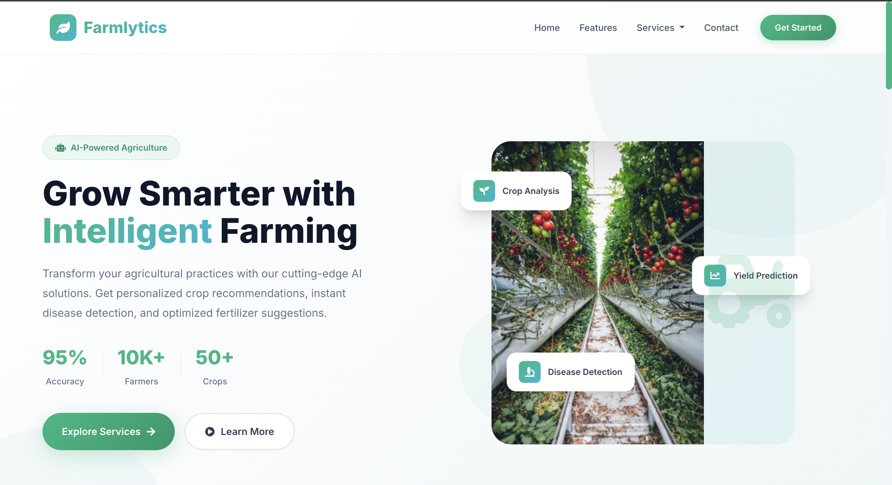
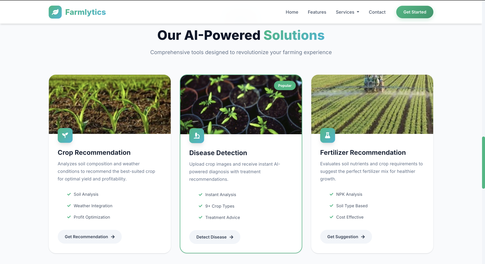
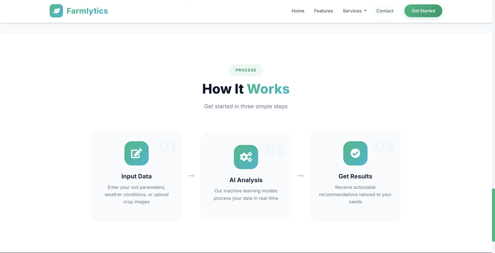
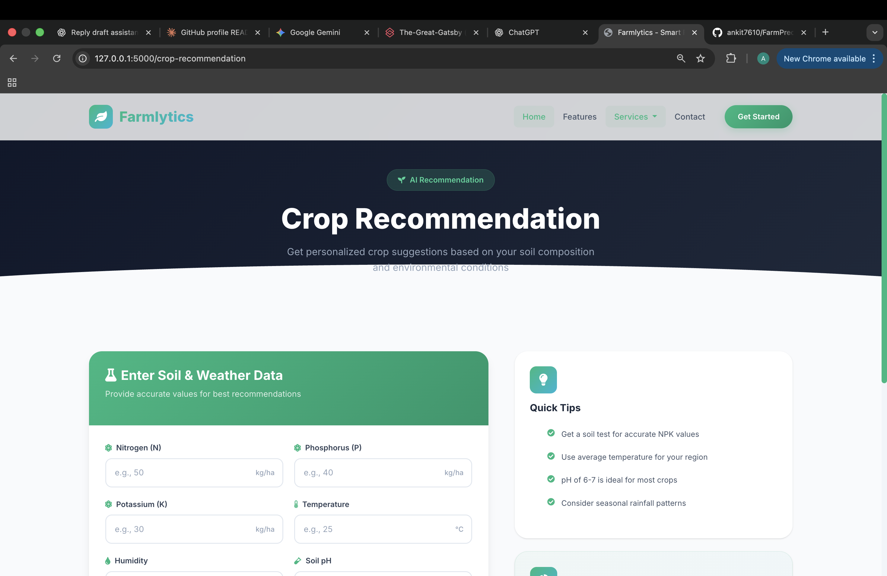
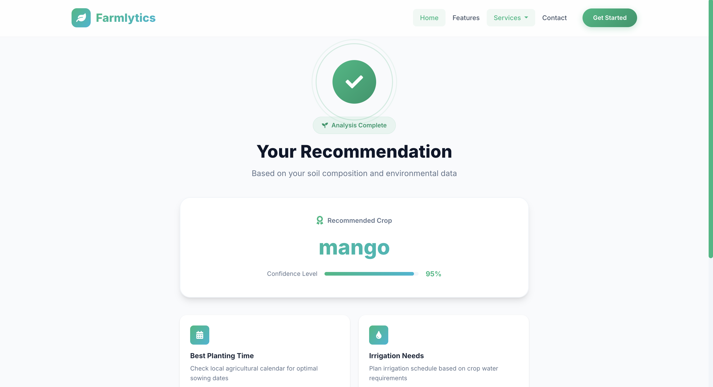

# Farmlytics

**AI-Powered Agricultural Intelligence Platform**

Smart crop recommendation, disease detection, and fertilizer suggestions using ML/DL to help farmers make data-driven decisions.

---

## ✨ Features

- **🌱 Crop Recommendation** - Analyze soil conditions and get crop suggestions
- **🧪 Fertilizer Recommendations** - Precise fertilizer guidance for your soil & crop
- **🔍 Crop Disease Detection** - AI image recognition for instant crop disease diagnosis
- **📱 Modern UI** - Beautiful, responsive interface with Bootstrap 5

---

## 📸 Screenshots







---

## 🚀 Quick Start

**Local Setup (5 min)**
```bash
git clone https://github.com/ankit7610/FarmPrediction.git
# Farmlytics

**AI-Powered Agricultural Intelligence Platform**

Farmlytics provides crop recommendations, disease detection, and fertilizer suggestions using a mix of ML and DL models — packaged as a Flask web app with a responsive frontend and Progressive Web App (PWA) capabilities.

---

## ✨ Key Features

- 🌱 Crop Recommendation: Predict the best crop given soil & environmental inputs.
- 🧪 Fertilizer Recommendation: Suggest fertilizer mixes based on soil composition.
- 🔍 Crop Disease Detection: Image-based disease detection using CNN models.
- 📱 PWA-ready Frontend: Service Worker + IndexedDB for offline asset caching and local prediction history.
- ⚡ Lightweight UI: Built with Bootstrap 5 and modern responsive components.

---

## 🏗 Architecture & Files

High level:

- `Farmlytics/app.py` — Flask app entry and route handlers.
- `Farmlytics/functions.py` — ML utilities: loading models, prediction wrappers.
- `Farmlytics/static/` — CSS, JS, service worker and client assets.
- `Farmlytics/templates/` — Jinja templates for pages and result screens.
- `Farmlytics/models/` — Stored ML and DL models (not all are committed — large models should be stored externally).

Recommended structure:

```
Farmlytics/
	app.py
	functions.py
	static/
		css/main.css
		js/my.js
		js/idb-service.js   # IndexedDB helper
		sw.js               # Service Worker
	templates/
	models/
	dataset/
```

---

## 🚀 Running Locally

1. Create and activate a virtual environment:

```bash
git clone https://github.com/ankit7610/FarmPrediction.git
cd FarmPrediction
python -m venv .venv
source .venv/bin/activate
pip install -r requirements.txt
```

2. Start the app (development):

```bash
python Farmlytics/app.py
# or use gunicorn for production-style testing:
# gunicorn -w 4 -b 0.0.0.0:5000 "Farmlytics.app:app"
```

3. Open http://127.0.0.1:5000

Environment variables (optional):

- `FLASK_ENV=development` (or `production`) 
- `PORT` for custom port when using containers / platforms

Note: Do NOT commit your virtual environment or large model files into the repository. `.gitignore` already excludes `.venv/`.

---

## 🐳 Docker

Build and run (the repo already contains a Dockerfile):

```bash
docker build -t farmlytics .
docker run --rm -p 5000:5000 farmlytics
```

For Cloud Run, build and push to your container registry and deploy (see Deployment section).

---

## 🧠 Models & Data

- The `models/DL_models/` folder contains several pre-trained Keras `.h5` models for disease detection per crop.
- Smaller ML models / utilities live in `models/ML_models/`.
- Large model files are heavy — consider moving them to an external storage (S3/GCS) and load at runtime.

When adding new models:

- Update `Farmlytics/functions.py` to include a loader that can fetch from disk or cloud.
- Keep a manifest (filename → purpose) to avoid confusion.

---

## 📡 PWA & Offline Behavior

- `static/sw.js` registers a Service Worker that caches core assets (CSS/JS/fonts) under `farmlytics-v1` for faster reloads and basic offline support.
- `static/js/idb-service.js` implements an IndexedDB wrapper (`FarmlyticsDB`) to store recent predictions locally and render them in the homepage's "Recent Activity" section.

Testing PWA features: Open DevTools → Application → Service Workers / Cache Storage / IndexedDB.

---

## ✅ Testing & CI

- Unit tests: `pytest` configured under `tests/` (if present).
- Frontend E2E: Playwright tests are included in the `playwright/` config (if present).
- CI: GitHub Actions workflows live in `.github/workflows/` — one workflow included for tests and linting.

Run tests locally:

```bash
pytest -q
# Playwright (if installed):
# npx playwright test
```

---

## ☁️ Deployment Options (recommended)

1) Render — easiest for Flask apps (connect GitHub, set build & start commands). Use `gunicorn "Farmlytics.app:app"` as start command.

2) Fly.io — container-first, global deploys. Good if you prefer Docker.

3) Google Cloud Run — serverless containers; recommended if you already use GCP.

4) AWS (Elastic Beanstalk / ECS / SageMaker) — if you need tight AWS integration or GPU inference.

Short Render setup:

```bash
# In Render dashboard: New → Web Service → Connect GitHub repo
# Build command: pip install -r requirements.txt
# Start command: gunicorn -w 4 -b 0.0.0.0:$PORT "Farmlytics.app:app"
```

---

## ⚙️ Production Tips

- Serve via `gunicorn` behind an HTTPS-enabled load balancer.
- Offload large model storage to object storage (S3/GCS) and load at runtime.
- Add logging and monitoring (Sentry / Cloud logging).
- Use a small cache (Redis) for expensive repeated predictions if needed.

---

## Contributing

1. Fork the repo and create a branch for changes (`feature/...`).
2. Run tests locally and ensure linting passes.
3. Open a PR describing the change.

---

## License

MIT — see the `LICENSE` file.


